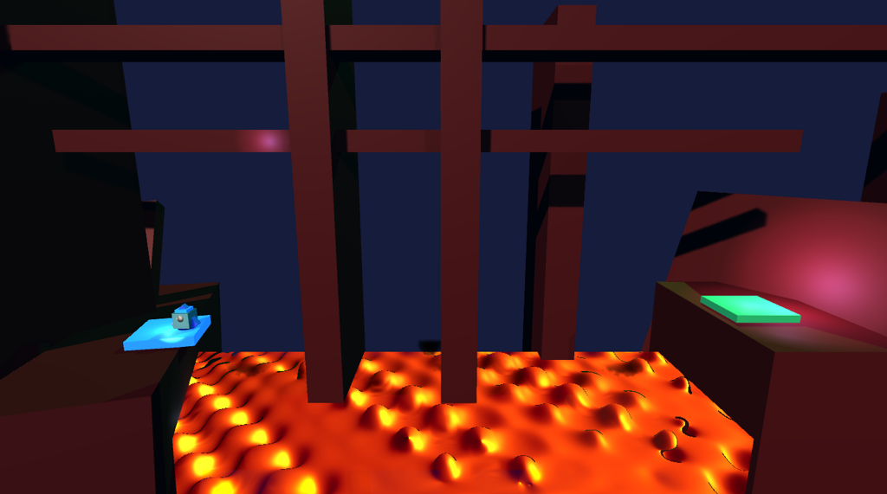
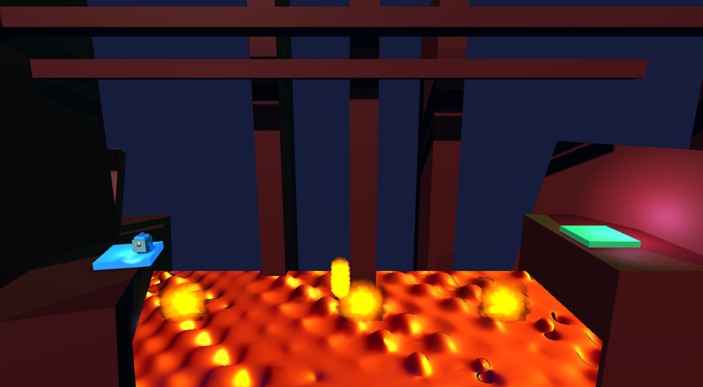
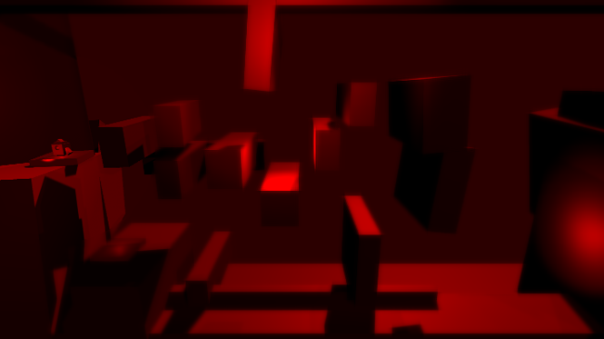
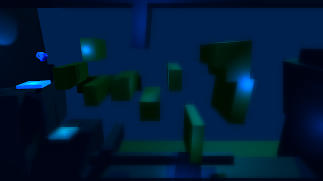
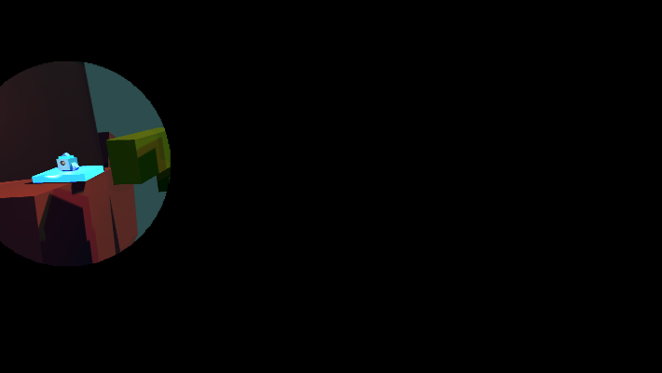

# Advanced Shaders in Unity

In this project, advanced shaders were created in Unity using HLSL to showcase innovative visual effects and rendering techniques. Each shader demonstrates distinct methods, below is a detailed description of each shader.

---

## RayMarching Shader

The RayMarching shader simulates a lava-like effect by projecting rays and applying sampling and distortion techniques on a sphere. 

### Key Features:
- **_Color**: Base color of the object.
- **_LightColor**: Color of the light source.
- **_Center**: Central position of the ray-marched object.
- **_Radius**: Radius of the object.
- **_Diffuse**: Intensity of diffuse reflection.
- **_Specular**: Intensity of specular reflection.
- **_Displacement**: Displacement amount for dynamic movement.

### Implementation Steps:
1. **Sphere SDF Function**: Calculates the distance from the camera to the sphere surface and simulates movement with displacement.
2. **RayMarching Function**: Iteratively advances rays and determines intersection with the sphere.
3. **Calculate Normal**: Computes the surface normal at a given point for realistic lighting.
4. **Light Diffuse & Specular**: Defines light interaction with the surface.

  

*Figure 1: Lava-like RayMarching effect.*

---

## Fire Shader

The Fire Shader creates a realistic flame effect using particles, textures, and GPU-based computations.

### Key Features:
- Dynamic particle generation.
- Customizable particle properties such as size, color, and transparency.
- Realistic motion using GPU buffers and randomness.

### Implementation Details:
- **Data Structures**: Defines vertex and particle attributes for GPU processing.
- **Quad Generation**: Dynamically generates particles' quads oriented towards the camera.
- **C# Integration**: Uses scripts to control particle behavior and generate the fire effect.

  

*Figure 2: Fire effect created with the Fire Shader.*

---

## Flexible Shader

The Flexible Shader is designed for versatile effects such as Gaussian Blur, focus, alarm, and underwater-like visuals.

### Key Features:
- **Gaussian Blur**: Smoothens and distorts the scene.
- Configurable options like blur radius, texture size, and focus radius.

### Implementation Details:
- **Shader Properties**:
  - _ClearColor and _FogColor: Base and fog colors.
  - _BlurRadius: Radius of the blur effect.
  - _MaxAge: Time-based fading for pixels.
  - _MaskTex: Mask area for effect application.
- **GrabPass**: Captures the rendered background for shader effects.
- **Vertex and Fragment Functions**: Transform vertex positions and interpolate colors dynamically.

### Image Placeholder:

  
  
  

*Figure 3: Alarm, Underwater and Focus examples of what is possible to do with this shader*

---

- **Gustavo Barros**
- **Fábio Lopes**

